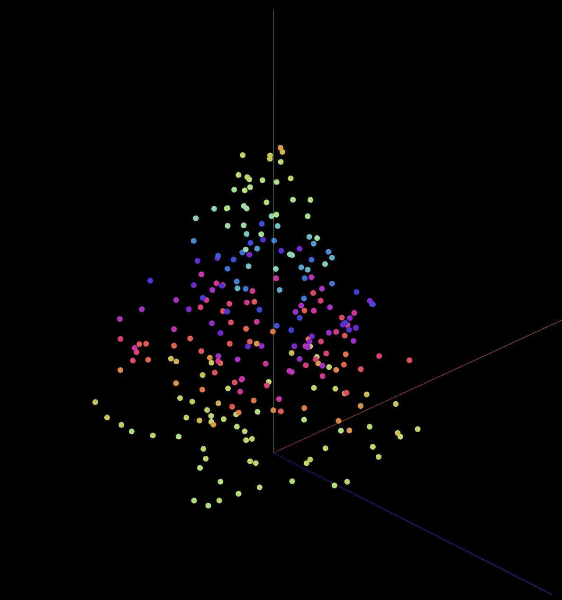

# TreeD-SDK

The repository contains all necessary source code to participate in [JUG Saxonys](https://www.jugsaxony.org) X-mas compition in 2022. For a detailed description of the competition, refer to this [blog post](https://jugsaxony.org/timeline/2022/10/1/Start-Weihnachtswettbewerb).

## How to get started?

Make sure you have a JDK 8 with JavaFX installed. After checking out the project, you can simply run
<pre>
mvn exec:java -P\!webapp -Dexec.args=" --positions=src/main/resources/treed_01.csv --strategy=org.jugsaxony.treed.examples.VerticalRainbow"
</pre>
to invoke the JavaFX simulator visualizing the <code>org.jugsaxony.treed.examples.VerticalRainbow</code> strategy.

Afterwards, you can start working with the class <code>org.jugsaxony.treed.MyStrategy</code>. It's best to implement in the following order:

1. Implement the <code>getAuthorEmail</code>, <code>getAuthorName</code>, <code>getDescription</code> and <code>getStrategyName</code> methods. If you don't find the method names to be self-explanatory, refer to the JavaDoc (link below).

1. Implement the <code>calcBulb</code> method.

1. If you want to submit your class in the EntwicklerHeld portal, you should also modify the <code>readyToSubmit</code> to return <code>true</code>.
 
## The coordinate system

At this point, you're probably asking: what is the orientation of the coordinate system? Look at the following picture:



The green axis is the Z axis, with positive values pointing up to the top of the tree. Red and blue axis are X and Y, respectively - the orientation of the axes should not matter, as we're typically considering an X-mas tree an axially symmetric body. 

Please note that the coordinates we're delivering with this repository are not equivalent to the coordinates that we'll be using when demonstrating the strategies to the public, hence please do not do any precalculation, rather calculate any values you need from the coordinates in an initialization phase within your strategy (as in the example below).

## A short tutorial: Z Scale Tree

Let's assume you want to color the TreeD LEDs by their Z coordinate: the listing below shows you a simple approach with explanations below.

```java
  // [3]
  private Double minCoord = Double.MAX_VALUE;
  private Double maxCoord = Double.MIN_VALUE;

  // [4]
  private boolean initDone = false;

  // [5]
  private int START_COLOR = 0xff0000;
  private int END_COLOR = 0xffff00;


  @Override
  protected void calcBulb(Bulb bulb, long timestamp) {
    // [1]
    if (bulb.getIndex() == 0 && minCoord < Double.MAX_VALUE && !initDone) {
      initDone = true;
    }

    if (!initDone) {
      // [2]
      minCoord = Math.min(minCoord, bulb.getZ());
      maxCoord = Math.max(maxCoord, bulb.getZ());
    } else {
      // [6]
      double coord = bulb.getZ();
      int color = (int)(START_COLOR+((END_COLOR-START_COLOR)*(coord-minCoord)/(maxCoord-minCoord))) & 0xffff00;
      bulb.setRgb(color);
    }  
  }
```

First, we need to determine the minimum and maximum coordinates within the TreeD's LEDs. This is done in the first round of <code>calcBulb</code> invocations and ends, when we're seeing the bulb #0 again (or, in other words when <code>minCoord</code> is smaller than its initial value <code>Double.MAX_VALUE</code>) [1]. During this first round we record [2] the minimum and maximum Z coordinates in the <code>minCoord</code> and <code>maxCoord</code> fields [3] and at the end of the initialization we also mark the initialization as done [4].

When the initialization is done, we can interpolate a color between the <code>START_COLOR</code> and the <code>END_COLOR</code> [5] using (slightly modified) linear interpolation and setting the LED color accordingly in [6]. Please note that this way to interpolate colors is not giving a nice color scale - it is used here just to keep the example simple.

## Frequently Asked Questions

### Can I use other languages than Java?

Yes, you need to use Java. But please, remember: , it's only about implementing a simple function, so you should not be overstrained by this.

### Which Java version do I need to use?

We accept only submissions which can be compiled with Java 8. 

### I don't have a JDK with JavaFX, can I still use this repo?

Yes, of course. You can exclude all JavaFX-using components from being compiled by activating the <code>suppressjavafx</code> Maven profile.
To compile, you just would execute
<pre>
mvn compile -Psuppressjavafx
</pre>

### How do I invoke the JavaFX simulator correctly?

That's quite easy, Maven is already configured to run it. Invoke it via
<pre>
mvn exec:java -Dexec.args=" --positions=src/main/resources/treed_01.csv --strategy=org.jugsaxony.treed.examples.VerticalRainbow"
</pre>

Obviously, you can replace the <code>org.jugsaxony.treed.examples.VerticalRainbow</code> with the class of the strategy that you want to run in the JavaFX simulator.

### What are the differences between implementing with this SDK versus completing the challenge in the EntwicklerHeld portal?

Getting started is definitely easier by participating in the [EntwicklerHeld challenge](https://platform.entwicklerheld.de/challenge/treed/) - this way, you can immediately start programming. Furthermore, test are automatically run to make sure you're doing things right (as fas as this can be checked). This comes with a downside: JavaFX is not available there.

If you want the full power or if you want to inspect the inner mechanics of the classes around the [<code>AnimationStrategy</code>](https://teamtreed.github.io/public/index.html?org/jugsaxony/treed/api/AnimationStrategy.html), you problably want to work with this SDK directly.

On both platform, you will be supported with a simulator: on the EntwicklerHeld platform you can use the Web Simulator, whereas when working with the TreeD SDK directly, it's easier to use the JavaFX simulator as described above.

## Building takes ages - how to speed up?

You can easily exclude the building of all frontend-resources (needed to run the Web Simulator) by deactivating the <code>webapp</code> Maven profile like in the following example:

<pre>
mvn compile -P\!webapp
</pre>

## Credits

This project was strongly inspired by Matt Parker 
([@standupmaths](https://twitter.com/standupmaths)) who published multiple YouTube videos on this idea. Thanks Matt. 

The Java SDK, the examples, documentation and the visualizations have been written by Steffen Gemkow and Falk Hartmann (both [JUG Saxony](https://www.jugsaxony.org)).

For consulting and active support during setting up the EntwicklerHeld integration we'd like to say thank you to Ilja Bauer and Philipp Dienst.

Our test user Valentin Ehrhardt helped us to describe the competition in a - hopefully - understable way. Thank you!

## Links

* [](https://TeamTreeD.github.io/public/)
* [EntwicklerHeld Challenge](https://platform.entwicklerheld.de/challenge/treed/)

## Contact

If you've got questions or something to share, feel free to reach out to us by sending an email
to [treed@jugsaxony.org](mailto:treed@jugsaxony.org).